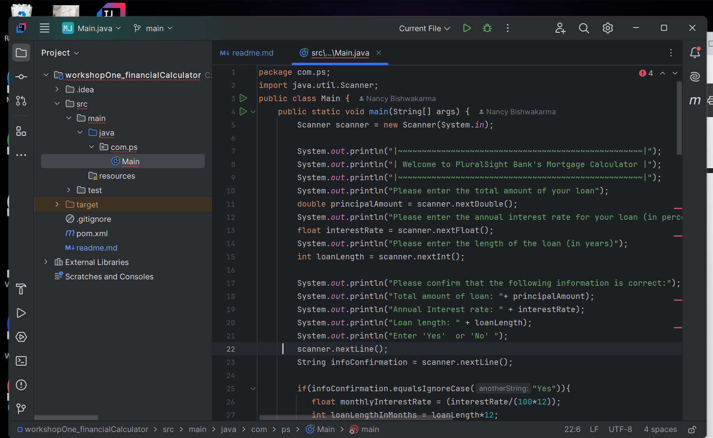
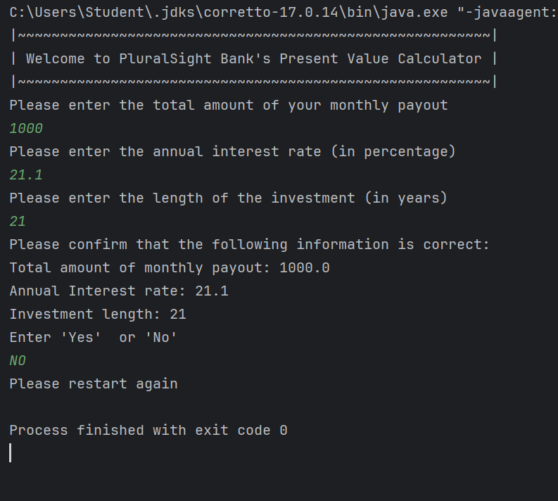

# Workshop 1

# Interesting code:
scanner.nextLine()

I had to use this code otherwise it was not taking my string input. I found out that if I'm inputting different data type then a string. I need a make a space in between them. scanner.nextLine() made that space and i was able to input my string without the code abruptly ending. 

# Home Screen

# Calculator 1

# Calculator 1 Output

# Calculator 2

# Calculator 2 Output

# Calulator 3

# Calculator 3 Output

# Error Message
